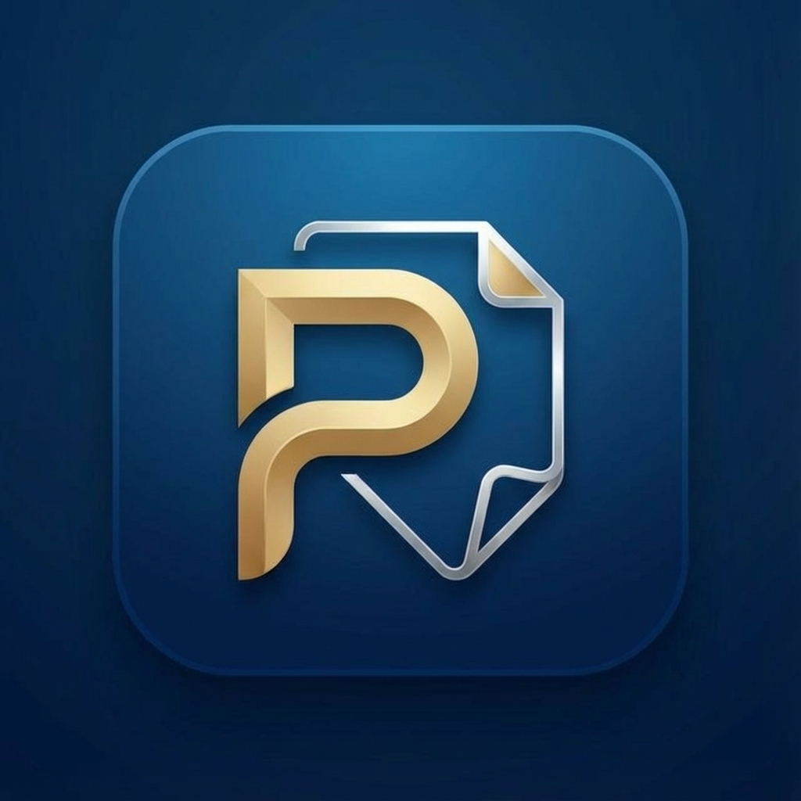

# 📱 Pensè - Smart Notes & Reminders App

<div align="center">



**تطبيق ذكي للملاحظات والتذكيرات مع الركن الإسلامي**

[](https://github.com/ahmedgamalmohamed121-ai/Pense-Notes-2)
[](https://www.android.com/)
[](LICENSE)

</div>

---

## ✨ المميزات

### 📝 إدارة الملاحظات
- ✅ إنشاء وتعديل وحذف الملاحظات
- 🎨 6 ألوان مختلفة للملاحظات
- 📂 تصنيف الملاحظات (شخصي، عمل، دراسة، صحة، تسوق، أخرى)
- 🔍 بحث سريع وذكي
- 📊 ترتيب متعدد الخيارات
- 📌 عداد تلقائي للملاحظات

### ⏰ التذكيرات الذكية
- 🔔 تذكير قبل الموعد بـ 24 ساعة
- ⏱️ تذكير قبل الموعد بـ 5 دقائق
- 🎯 تذكير في الموعد المحدد
- 🔊 إشعارات صوتية مخصصة
- 📅 تحديد دقيق للتاريخ والوقت

### 🌙 الركن الإسلامي

#### 📿 السبحة الإلكترونية
- عداد تلقائي للتسبيح
- 4 أنواع تسبيح (سبحان الله، الحمد لله، الله أكبر، أستغفر الله)
- هدف قابل للتخصيص
- زر إعادة ضبط

#### 🤲 الأذكار
- أذكار الصباح والمساء
- أذكار النوم
- أذكار بعد الصلاة
- عداد لكل ذكر
- وضع التركيز للقراءة

#### 🕌 مواقيت الصلاة
- عرض مواقيت الصلاة الخمس + الشروق
- تحديد تلقائي للموقع
- عرض التاريخ الهجري
- تنبيهات صوتية (أذان المنشاوي + رنة روحانية)

### 🎨 التخصيص
- 🌓 وضع ليلي/نهاري
- 🌍 دعم اللغتين (عربي/إنجليزي)
- 🎭 تخصيص اسم الدلع
- 👤 اختيار النوع (ذكر/أنثى)

### 💾 النسخ الاحتياطي
- 📥 نسخ احتياطي تلقائي
- 📤 تصدير/استيراد البيانات
- 🔄 مزامنة محلية

---

## 🚀 التقنيات المستخدمة

- **Frontend:** HTML5, CSS3, JavaScript (ES6+)
- **Framework:** Capacitor 6.0
- **Platform:** Android
- **Storage:** LocalStorage
- **Notifications:** Capacitor Local Notifications
- **Fonts:** Cairo, Tajawal (Google Fonts)

---

## 📦 التثبيت والتشغيل

### المتطلبات
- Node.js (v14 أو أحدث)
- Android Studio
- JDK 17

### خطوات التثبيت

```bash
# 1. استنساخ المشروع
git clone https://github.com/ahmedgamalmohamed121-ai/Pense-Notes-2.git
cd Pense-Notes-2

# 2. تثبيت الحزم
npm install

# 3. نسخ الملفات إلى www
npm run build

# 4. مزامنة Capacitor
npm run sync

# 5. فتح في Android Studio
npx cap open android
```

---

## 🏗️ البناء التلقائي (GitHub Actions)

التطبيق يتم بناؤه تلقائياً عند كل push إلى branch `main`:

1. ✅ تثبيت Node.js و JDK
2. ✅ تثبيت الحزم
3. ✅ بناء Web Assets
4. ✅ مزامنة Android
5. ✅ بناء APK
6. ✅ رفع APK إلى GitHub Releases

**رابط التحميل:** [أحدث إصدار](https://github.com/ahmedgamalmohamed121-ai/Pense-Notes-2/releases/latest)

---

## 📱 لقطات الشاشة

<div align="center">

| الشاشة الرئيسية | الركن الإسلامي | الإعدادات |
|:---:|:---:|:---:|
|  |  |  |

</div>

---

## 🤝 المساهمة

المساهمات مرحب بها! يرجى:

1. Fork المشروع
2. إنشاء branch جديد (`git checkout -b feature/AmazingFeature`)
3. Commit التغييرات (`git commit -m 'Add some AmazingFeature'`)
4. Push إلى Branch (`git push origin feature/AmazingFeature`)
5. فتح Pull Request

---

## 📄 الترخيص

هذا المشروع مرخص تحت رخصة MIT - انظر ملف [LICENSE](LICENSE) للتفاصيل.

---

## 👨‍💻 المطور

**Eng. Ahmed Gamal**

- 📧 Email: [ahmedgamalmohamed121@gmail.com](mailto:ahmedgamalmohamed121@gmail.com)
- 💼 LinkedIn: [Ahmed Gamal](https://linkedin.com/in/ahmed-gamal)
- 📱 WhatsApp: [+201118770729](https://wa.me/201118770729)

---

## 🙏 شكر وتقدير

- شكر خاص لـ [Capacitor](https://capacitorjs.com/) على الإطار الرائع
- شكر لـ [Google Fonts](https://fonts.google.com/) على الخطوط العربية الجميلة
- شكر لجميع المساهمين والمستخدمين

---

<div align="center">

**صُنع بـ ❤️ في مصر**

⭐ إذا أعجبك المشروع، لا تنسى إعطائه نجمة!

</div>
